  
    
  
  
  
  

    <i>"The past is immutable, but the future can be changed."</i>
  

 

  
  
  
  
  
  
  
  

 

  

 

  

 

  

 

  

 

<table align="center" border="0" width="100%" cellpadding="5">
  <tr>
    <td width="50%" align="center">
      
    </td>
    <td width="50%" align="center">
      
    </td>
  </tr>
</table>

  

 

  
    
  
    
  
    
  

 

  

 

  

 

  
  

    
    
    
    
    
    
    
    
    
  

  
  

    
    
    
    
    
    
    
    
    
    
    
    
    
    
    
  

  
  

    
    
    
    
    
    
    
    
    
  

  
  

    
    
    
    
    
    
    
    
    
    
  

  
  

    
    
    
    
    
    
    
    
    
    
    
    
    
    
  

  
  

    
    
    
    
    
    
    
    
    
    
    
  

  
  

    
    
    
    
    
    
    
    
    
    
    
    
    
    
    
    
    
    
    
  

  
  

    
    
    
    
    
    
    
    
    
    
    
    
    
    
    
    
    
  

 

  

 

<!-- RECREATIONAL DATA -->

  

 

  

 

  

