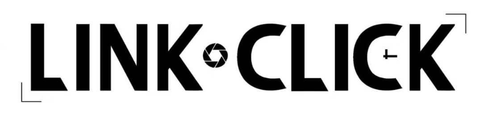

 

 

<h3><i>"The past is immutable, but the future can be changed."</i></h3>

 

<!-- COMPACT SIDE-BY-SIDE LAYOUT (0 Indentation to prevent Markdown code block!) -->
<table border="0" width="100%" align="center">
<tr>
<td width="40%" valign="top" align="center">
  
<h3>🎞️ Mission Briefing</h3>

<b>Rule #1:</b> You have exactly 12 hours. 
<b>Rule #2:</b> Do exactly as I say. 
<b>Rule #3:</b> Whatever happened, let it be.

 

👨‍💻 <b>Digital Archives:</b> <a href="https://blazeio.artstation.com/">ArtStation</a> 
📫 <b>Lu Guang's Comms:</b> pushkarpan03@gmail.com 
📄 <b>Client Data:</b> <a href="https://linktr.ee/BlazeioX">LinkTree</a> 
⚡ <b>Special Ability:</b> Fast Learner

</td>

<td width="60%" valign="top" align="center">
<h3>🎶 Time Travel Frequency</h3>

<table border="1" bordercolor="#00BFFF" style="border-collapse: collapse; border-radius: 10px; background-color: #0d1117;" cellpadding="10" width="90%">
<tr>
<td width="30%" align="center" style="border-right: none;">

</td>
<td width="70%" align="left" style="border-left: none;">
<h4 style="color: #FFD700; margin-bottom: 5px;">Dive Back In Time</h4>

Link Click OP • Bicas

<!-- Waveform visual -->
 

<!-- Visual Playback Controls -->

<!-- Fallback HTML Audio Element (GitHub may strip this natively) -->
<audio controls autoplay loop style="width: 100%; height: 30px; outline: none; margin-top: 5px;">
<source src="assets/Dive%20Back%20In%20Time(%E5%8B%95%E7%95%AB%E3%80%8A%E6%99%82%E5%85%89%E4%BB%A3%E7%90%86%E4%BA%BA%E3%80%8B%E7%89%87%E9%A0%AD%E6%9B%B2).mp3" type="audio/mpeg">
<source src="assets/Dive%20Back%20In%20Time(動畫《時光代理人》片頭曲).mp3" type="audio/mpeg">
Your browser does not support the audio element.
</audio>
</td>
</tr>
</table>

 
<!-- TROPHIES -->

</td>
</tr>
</table>

---

---

## 🧩 Developed Traits // Tech Stack

### 💻 Core Languages
        

### 🚀 Frontend & Web
              

### ⚙️ Backend & APIs
        

### 🗄️ Database & Cloud
         

### 🔧 DevOps & Tools
             

### 🤖 AI, Data & ML
          

### 🎨 Design & Animation
                  

### 🌍 OS, Platforms & Environments
                 

### 🌐 Intercom & Services
                     

---

<!-- COMPACT SIDE-BY-SIDE STATS -->
## 📸 Film Roll // GitHub Stats

<table border="0" width="100%" align="center">
<tr>
<td width="50%" align="center" valign="top">

</td>
<td width="50%" align="center" valign="top">

</td>
</tr>
</table>

---

## 🤝 High Five // End Dive Link

