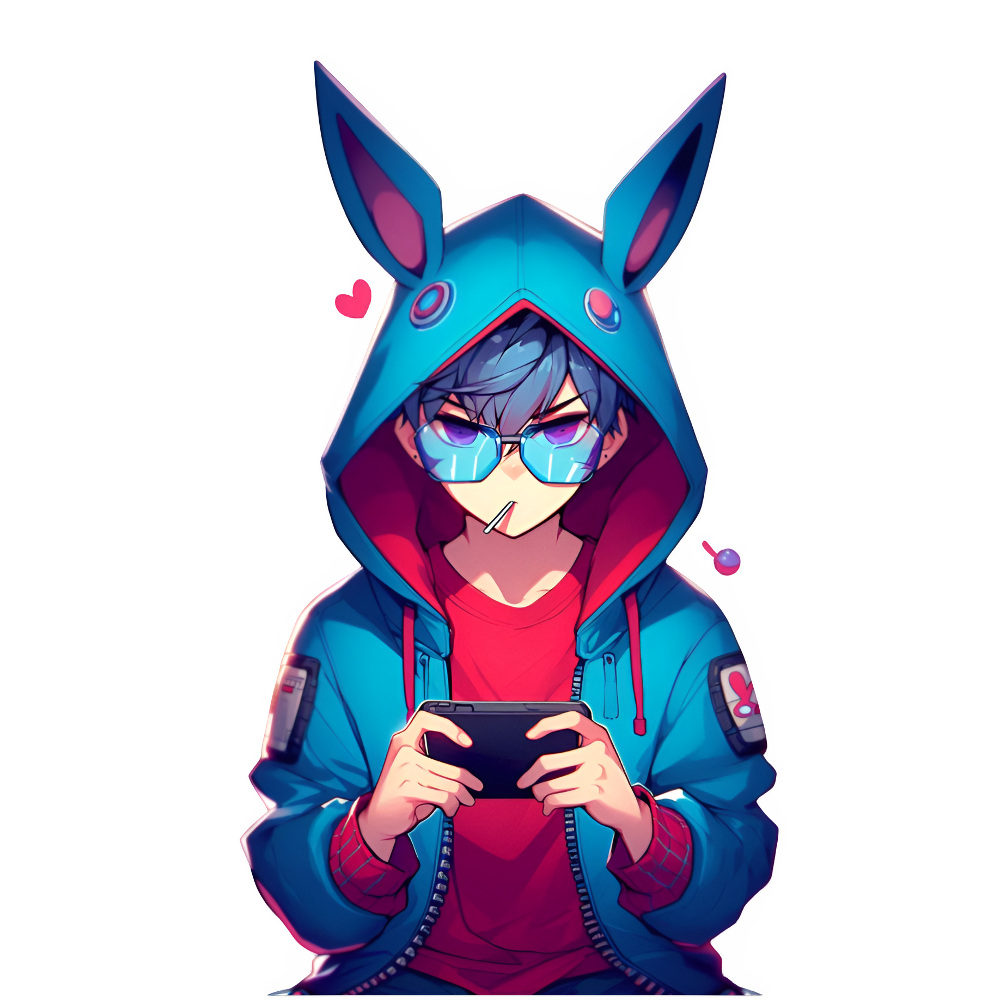

  <picture>
    <source media="(prefers-color-scheme: dark)" srcset="assets/images/banner.jpg">
    <source media="(prefers-color-scheme: light)" srcset="assets/images/banner.jpg">
    
  </picture>

 

  <picture>
    <source media="(prefers-color-scheme: dark)" srcset="https://readme-typing-svg.herokuapp.com?font=Fira+Code&weight=800&size=35&duration=3000&pause=1000&color=00BFFF&center=true&vCenter=true&width=800&height=50&lines=Welcome+to+Time+Photo+Studio;Pushkar+Pan+%7C+FullStack+Developer;Animator+%7C+UI/UX+Designer">
    <source media="(prefers-color-scheme: light)" srcset="https://readme-typing-svg.herokuapp.com?font=Fira+Code&weight=800&size=35&duration=3000&pause=1000&color=32CD32&center=true&vCenter=true&width=800&height=50&lines=Welcome+to+Time+Photo+Studio;Pushkar+Pan+%7C+FullStack+Developer;Animator+%7C+UI/UX+Designer">
    
  </picture>
  
  

    <i>"The past is immutable, but the future can be changed."</i>
  

  
  

    <a href="https://github.com/myst-blazeio">
      <picture>
        <source media="(prefers-color-scheme: dark)" srcset="https://komarev.com/ghpvc/?username=myst-blazeio&label=Dives+Into+Profile&color=00BFFF&style=flat">
        <source media="(prefers-color-scheme: light)" srcset="https://komarev.com/ghpvc/?username=myst-blazeio&label=Dives+Into+Profile&color=32CD32&style=flat">
        
      </picture>
    </a>
  

  
   

  <!-- SOCIAL STRIP -->
   
   
  
  
  
  

<table width="100%" border="0" cellpadding="10" style="border: 1px solid rgba(0, 191, 255, 0.2); border-radius: 15px; box-shadow: 0 4px 30px rgba(0, 191, 255, 0.05);">
  <tr>
    <td width="35%" align="center" valign="middle">
      <a href="https://github.com/myst-blazeio">
        <picture>
            <source media="(prefers-color-scheme: dark)" srcset="assets/images/profile.png">
            <source media="(prefers-color-scheme: light)" srcset="assets/images/profile.png">
            
        </picture>
      </a>
    </td>
    <td width="65%" valign="top">
      <h2>🎞️ Mission Logs</h2>
      <blockquote>
        <i>"Rule #1: You have exactly 12 hours."</i> 
        <i>"Rule #2: Do exactly as I say and leave nothing to chance."</i> 
        <i>"Rule #3: Whatever happened in the past, let it be."</i>
      </blockquote>
      
       

      

        <a href="https://blazeio.artstation.com/">
          <picture>
            <source media="(prefers-color-scheme: dark)" srcset="https://img.shields.io/badge/Digital_Archives-0d1117?style=for-the-badge&logo=artstation&logoColor=00BFFF&border=00BFFF">
            <source media="(prefers-color-scheme: light)" srcset="https://img.shields.io/badge/Digital_Archives-f0fff0?style=for-the-badge&logo=artstation&logoColor=32CD32&labelColor=f0fff0">
            
          </picture>
        </a>

        <a href="mailto:pushkarpan03@gmail.com">
          <picture>
            <source media="(prefers-color-scheme: dark)" srcset="https://img.shields.io/badge/Contact_Me:-_pushkarpan03@gmail.com-0d1117?style=for-the-badge&logo=minutemailer&logoColor=FFD700">
            <source media="(prefers-color-scheme: light)" srcset="https://img.shields.io/badge/Contact_Me:-_pushkarpan03@gmail.com-f0fff0?style=for-the-badge&logo=minutemailer&logoColor=333333">
            
          </picture>
        </a>

        <a href="https://linktr.ee/BlazeioX">
          <picture>
            <source media="(prefers-color-scheme: dark)" srcset="https://img.shields.io/badge/Client_Data-00BFFF?style=for-the-badge&logo=linktree&logoColor=black">
            <source media="(prefers-color-scheme: light)" srcset="https://img.shields.io/badge/Client_Data-32CD32?style=for-the-badge&logo=linktree&logoColor=white">
            
          </picture>
        </a>
        
        <picture>
          <source media="(prefers-color-scheme: dark)" srcset="https://img.shields.io/badge/Special_Trait:-_Fast_Learner-0d1117?style=for-the-badge&logo=lightning&logoColor=FFD700">
          <source media="(prefers-color-scheme: light)" srcset="https://img.shields.io/badge/Special_Trait:-_Fast_Learner-32CD32?style=for-the-badge&logo=lightning&logoColor=white">
          
        </picture>
      

    </td>
  </tr>
</table>

 

<!-- PRIMARY TELEMETRY GRAPHS PROMOTED TO TOP -->

  <picture>
    <source media="(prefers-color-scheme: dark)" srcset="https://github-readme-activity-graph.vercel.app/graph?username=myst-blazeio&bg_color=0d1117&color=c9d1d9&line=FFD700&point=00BFFF&area=true&hide_border=false&title_color=00BFFF&radius=15">
    <source media="(prefers-color-scheme: light)" srcset="https://github-readme-activity-graph.vercel.app/graph?username=myst-blazeio&bg_color=f0fff0&color=333333&line=32CD32&point=32CD32&area=true&hide_border=false&title_color=32CD32&radius=15">
    
  </picture>

 

<!-- COMPACT SIDE-BY-SIDE STATS -->
## 📸 Telemetry Logs // GitHub Stats

<table align="center" border="0" width="100%" cellpadding="5">
  <!-- ROW 1: Grid Stats & Top Languages -->
  <tr>
    <td width="50%" align="center">
      <picture>
        <source media="(prefers-color-scheme: dark)" srcset="https://github-readme-stats-sigma-five.vercel.app/api?username=myst-blazeio&show_icons=true&bg_color=0d1117&title_color=00BFFF&text_color=c9d1d9&icon_color=FFD700&border_color=00BFFF&border_radius=15">
        <source media="(prefers-color-scheme: light)" srcset="https://github-readme-stats-sigma-five.vercel.app/api?username=myst-blazeio&show_icons=true&bg_color=f0fff0&title_color=32CD32&text_color=333333&icon_color=32CD32&border_color=32CD32&border_radius=15">
        
      </picture>
    </td>
    <td width="50%" align="center">
      <picture>
        <source media="(prefers-color-scheme: dark)" srcset="https://github-readme-stats-sigma-five.vercel.app/api/top-langs/?username=myst-blazeio&layout=compact&hide=jupyter%20notebook&bg_color=0d1117&title_color=00BFFF&text_color=c9d1d9&border_color=00BFFF&border_radius=15">
        <source media="(prefers-color-scheme: light)" srcset="https://github-readme-stats-sigma-five.vercel.app/api/top-langs/?username=myst-blazeio&layout=compact&hide=jupyter%20notebook&bg_color=f0fff0&title_color=32CD32&text_color=333333&border_color=32CD32&border_radius=15">
        
      </picture>
    </td>
  </tr>
</table>

   
  <picture>
    <source media="(prefers-color-scheme: dark)" srcset="https://github-readme-streak-stats.herokuapp.com/?user=myst-blazeio&background=0d1117&stroke=00BFFF&ring=FFD700&fire=FFD700&currStreakNum=00BFFF&currStreakLabel=c9d1d9&sideNums=c9d1d9&sideLabels=c9d1d9&dates=c9d1d9&border_radius=15&border=00BFFF">
    <source media="(prefers-color-scheme: light)" srcset="https://github-readme-streak-stats.herokuapp.com/?user=myst-blazeio&background=f0fff0&stroke=32CD32&ring=32CD32&fire=32CD32&currStreakNum=32CD32&currStreakLabel=333333&sideNums=333333&sideLabels=333333&dates=333333&border_radius=15&border=32CD32">
    
  </picture>
    

<!-- SINGLE ROW TROPHIES MATCHING THEME -->

  <picture>
    <source media="(prefers-color-scheme: dark)" srcset="https://github-profile-trophy.screw-hand.vercel.app/?username=myst-blazeio&theme=radical&row=1&column=6&margin-w=10&margin-h=10&no-bg=true&no-frame=true">
    <source media="(prefers-color-scheme: light)" srcset="https://github-profile-trophy.screw-hand.vercel.app/?username=myst-blazeio&theme=journey&row=1&column=6&margin-w=10&margin-h=10&no-bg=true&no-frame=true">
    
  </picture>

## 🧩 The Arsenal // Classified Tech Stack

<h3 style="color: #00BFFF;">💻 Core Languages</h3>

  
  
  
  
  
  
  
  
  

<h3 style="color: #FFD700;">🚀 Frontend & Web Elements</h3>

  
  
  
  
  
  
  
  
  
  
  
  
  
  
  

<h3 style="color: #00BFFF;">⚙️ Backend Systems & APIs</h3>

  
  
  
  
  
  
  
  
  

<h3 style="color: #FFD700;">🗄️ Database & Cloud Mainframes</h3>

  
  
  
  
  
  
  
  
  
  

<h3 style="color: #00BFFF;">🔧 DevOps & Security</h3>

  
  
  
  
  
  
  
  
  
  
  
  
  
  

<h3 style="color: #FFD700;">🤖 AI, Neural & Data Computing</h3>

  
  
  
  
  
  
  
  
  
  
  

<h3 style="color: #00BFFF;">🎨 Visuals, Rendering & Animation</h3>

  
  
  
  
  
  
  
  
  
  
  
  
  
  
  
  
  
  
  

<h3 style="color: #FFD700;">🌍 Operating Systems & Platforms</h3>

  
  
  
  
  
  
  
  
  
  
  
  
  
  
  
  
  

